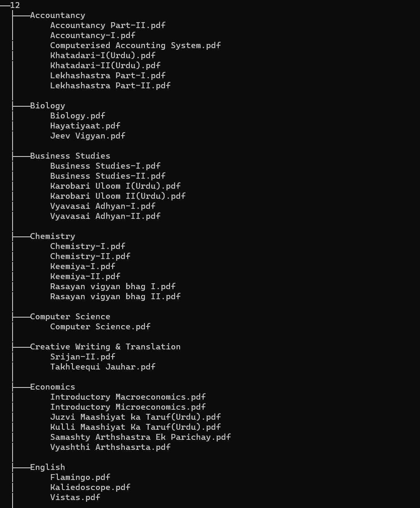

# NCERT Books Downloader

<p align="center">

</p>
Python script to cleanly scrape all books from https://ncert.nic.in/textbook.php organised by classes and subjects

## Usage

```sh
# Install requirements (pip or pip3)
pip install -r requirements.txt

# Download all zips (python or python3)
python download.py

# Extract and merge zips to create pdfs
python merge_pdfs.py
```

#### Screenshot



#### Generating `data.json` with latest data

This script uses the data in `data.json` to scrape the books. If it's outdated, you can regenerate it using the latest data.

1. Get the latest relevant source from [view-source:https://ncert.nic.in/textbook.php](view-source:https://ncert.nic.in/textbook.php) and paste it to `sourceScript.js`
2. Cleanup the script (format, remove comments etc)
3. Run `python parse_script.py`
